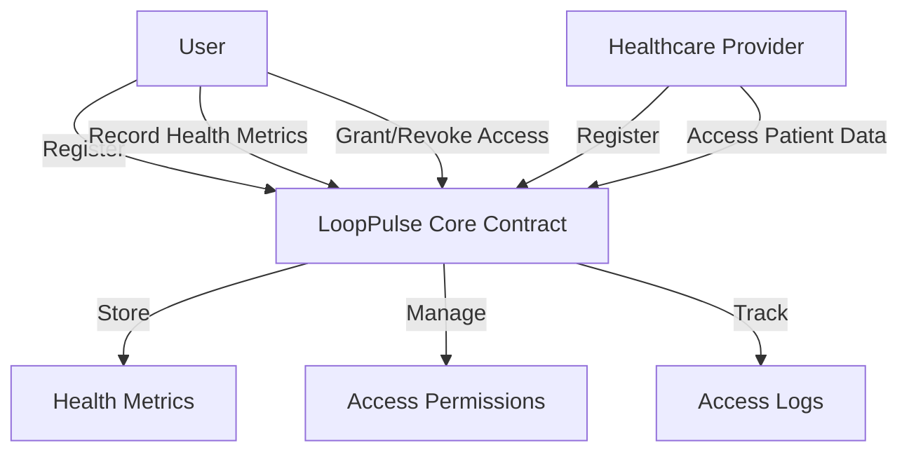

# LoopPulse Health Monitoring Platform

A blockchain-based health monitoring platform that provides secure, private, and immutable health records management on the Stacks blockchain.

## Overview

LoopPulse enables individuals to:
- Securely store personal health metrics
- Grant temporary access to healthcare providers
- Maintain complete ownership of medical data
- Connect health monitoring devices and applications
- Create an auditable history of health records

## Architecture

The LoopPulse platform is built around a core smart contract that manages user registration, health data storage, and access control.



### Core Components
- User Registry
- Healthcare Provider Registry
- Health Metrics Storage
- Access Permission System
- Access Logging System

## Contract Documentation

### LoopPulse Core Contract

The main contract handling all platform functionality.

#### Supported Health Metrics
- Heart Rate
- Blood Pressure
- Glucose
- Temperature
- Oxygen
- Weight
- Steps
- Sleep

#### Access Control
- Users own their data by default
- Healthcare providers can receive temporary access grants
- Access is metric-specific and time-limited
- All data access is logged for audit purposes

## Getting Started

### Prerequisites
- Clarinet
- Stacks wallet
- Development environment for Clarity

### Installation

1. Clone the repository
2. Install dependencies
3. Deploy using Clarinet

```bash
clarinet deploy
```

### Basic Usage

1. Register as a user:
```clarity
(contract-call? .looppulse-core register-user)
```

2. Record a health metric:
```clarity
(contract-call? .looppulse-core record-health-metric 
    METRIC-HEART-RATE 
    (list 75) 
    none)
```

3. Grant access to a healthcare provider:
```clarity
(contract-call? .looppulse-core grant-access 
    'PROVIDER_ADDRESS 
    u1440 
    (list METRIC-HEART-RATE METRIC-BLOOD-PRESSURE))
```

## Function Reference

### User Management

```clarity
(register-user) -> (response bool uint)
```
Registers a new user on the platform.

```clarity
(register-healthcare-provider (name (string-ascii 64))) -> (response bool uint)
```
Registers a new healthcare provider.

### Health Data Management

```clarity
(record-health-metric (metric-type uint) (values (list 10 int)) (metadata (optional (string-utf8 256)))) -> (response uint uint)
```
Records a new health metric for the user.

### Access Control

```clarity
(grant-access (provider-id principal) (duration uint) (metric-types (list 8 uint))) -> (response bool uint)
```
Grants temporary access to a healthcare provider.

```clarity
(revoke-access (provider-id principal)) -> (response bool uint)
```
Revokes access from a healthcare provider.

### Data Retrieval

```clarity
(get-health-metric (user-id principal) (metric-id uint)) -> (response {...} uint)
```
Retrieves a specific health metric.

```clarity
(get-metrics-by-type (user-id principal) (metric-type uint) (limit uint)) -> (response bool uint)
```
Retrieves metrics of a specific type.

## Development

### Testing

Run the test suite using Clarinet:

```bash
clarinet test
```

### Local Development

1. Start a local Clarinet console:
```bash
clarinet console
```

2. Deploy the contract:
```clarity
(contract-call? .looppulse-core ...)
```

## Security Considerations

### Data Privacy
- All data access is strictly controlled through permissions
- Access grants are time-limited
- All data access is logged and auditable

### Known Limitations
- Maximum access grant duration is 30 days
- Health metric values are stored as integers
- Limited to 8 metric types per access grant
- Maximum 10 values per metric entry

### Best Practices
- Regularly review and revoke unused access grants
- Keep access durations as short as practical
- Monitor access logs for unauthorized attempts
- Use specific metric types rather than granting access to all metrics